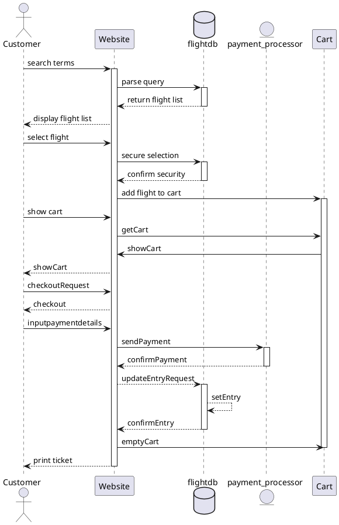

Create a UML sequence diagram that will show your clients how the system’s classes will interact when customers are buying their flight tickets on the booking website.

```plantuml
@startuml 
actor Customer as customer  

participant Website as ws
database flightdb as db
entity payment_processor as visa
participant Cart as cart 

customer -> ws : search terms
activate ws
ws -> db : parse query
activate db
ws <-- db : return flight list 
deactivate db
customer <-- ws : display flight list
customer -> ws : select flight 
ws -> db : secure selection
activate db
db --> ws : confirm security
deactivate db
ws -> cart : add flight to cart
activate cart
customer -> ws : show cart
ws -> cart : getCart
cart -> ws : showCart
ws --> customer : showCart
customer -> ws : checkoutRequest
ws --> customer : checkout
customer -> ws : inputpaymentdetails
ws -> visa : sendPayment
activate visa
visa --> ws : confirmPayment
deactivate visa
ws --> db : updateEntryRequest
activate db
db --> db : setEntry
ws <-- db : confirmEntry
deactivate db
ws -> cart : emptyCart
deactivate cart
ws --> customer : print ticket
deactivate ws
@enduml 
```

