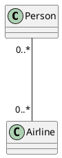

```plantuml
@startuml
class Person 
class Airline

Person "0..*"  --- "0..*" Airline 
@enduml
```
```java
public class Student{
	public void play(Sport sport){
	...
	}
}
```
```java
public class Food{
	public void Wine(Wine wine){
		execute.pair(food);
	}
}
```