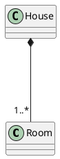

![[literature/OOP Design/Lexicon/Composition|Composition]]

```java
public class Human{ 
	private Brain brain;

	public Human(){
		brain = new Brain();
	}
}
```
```java
public class Employee{
  private Salary salary;
  
  public Employee(Salary employeeSalary){
    this.salary = employeeSalary;
  }
}
```