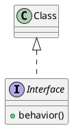

```java
public class Dog implements IAnimal {

public void move() {...}

public void speak() { ... }

public void eat() {... }
 
}
```
all the method signatures must be explicitly declared in the class. 

